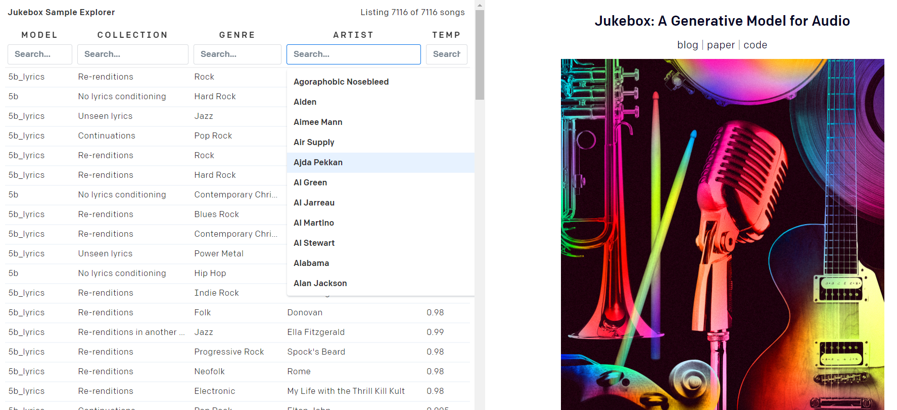

# [back](../)

# AI Juke Box

## 1. Object: AI Jukebox 

- Name: Jukebox by Open AI.
- Date: 30th April 2020 (The date on which Open AI first debuted Jukebox)
- IP Rights: Copyright
- Material readings: Jukebox is a computer program that generate music audios.

## 2. Object Summary 

The computer technology has been developing quickly nowadays. Machines could not only be used as tools to improve work efficiency, but also become more and more sophisticated and intelligent to ‘create’ new things autonomously without human intervention. The Jukebox program created by the Open AI company is a typical example. Being trained with a dataset of 1.2 million songs scraped from the web, Jukebox could rearrange the music fragments and generate raw audio several minutes long with singing in accordance with the user’s choice of genre and artist-style without human intervention.[^1] Although it sounds really impressive, Jukebox may also induce potential copyright issues. This note will mainly discuss the copyright of music work generated by Jukebox with the following questions:

* Should the music generated by Jukebox be protected by copyright?

* If so, who should be the author of those works?

## 3. Image

## 4. Legal issues

Different from traditional works protected by the copyright law, the music work created by Jukebox do not have a human author. The work is mainly generated by the computer through the process of deep learning which trains the computers to 'create' new songs. According to CDPA 1988 section 178, this kind of work could be defined as ‘computer-generated work’, which means that the work is generated by computer in circumstances such that there is no human author of the work. The computer-generated work is also different from computer-aid work, in which computer plays a role as a tool and the core part of the work still relies on humans’ creativity. 

With the development of artificial intelligence, more and more computer-generated works are coming out and becoming commonplace in people’s daily life. However, the copyright issue of computer-generated work still remains uncertain. In the US, there is no specific legislation in relation to this issue. And the case law showed a negative attitude on giving copyright to computer-generated works.[^2] Therefore, according to the US law, the music generated by Jukebox may not be protected with copyright. However, the UK holds a different stance on this issue. The CDPA 1988 in the UK was regarded as the first legislation in the world which protected copyright in the context of artificial intelligence. [^3] According to CDPA 1988 section 9(3), 'in the case of a literary, dramatic, musical or artistic work which is computer-generated, the author shall be taken to be the person by whom the arrangements necessary for the creation of the work are undertaken'.  This provision showed an explicit standpoint of protecting the copyright of computer-generated works. The intention of the law is to provide 'flexibility for future technological developments'[^4] and 'allow future investment in AI to be made with confidence'.[^5] It appears that these provisions are foresighted to shed a light on the issue of the copyright and the author of computer-generated works three decades ago. 

In light of CDPA s9(3), the music generated by Jukebox can be protected by copyright law and the author of the music work should be the one 'by whom the arrangements necessary for the creation of work are undertaken'. However, how to determine the person who has undertaken necessary arrangements for the work generated by Jukebox? If the one whom CDPA s9(3) points to is the programmer of Jukebox, then by creating the Jukebox program, the programmer may not only be the author of Jukebox, but also be the composer of countless music works generated by Jukebox. It will also be problematic to consider the user as the author of Jukebox music, because the user cannot meet the requirement of necessary originality to receive copyright by simply inputting different parameters randomly.

It is obvious that the CDPA 9(3) has its limitations. Firstly, the provision is ambiguous and it is difficult to find the one who undertakes necessary arrangements for the computer-generated work.[^6] Although in the *Nova* case[^7], it is sound to determine the programmer rather than the game player as the author of the work according to CDPA s 9(3). In other situations, things could be more entangled when the programmer could not fully explain and control the AI. Secondly, the provision intended to 'trace the most relevant human intervention associated with the [computer-generated] work'.[^8] It relates to the human who do not have necessary originality on the computer-generated works as the author, which does not fit in with the requirement of originality in copyright law.[^9] This provision is also at variance with the traditional copyright law rule[^10] by separating authorship with creation and stipulating a  human who did not create the work as the author. Thirdly, this provision lacks the justification since it may not be the best way to achieve the intention to encourage investment in AI. The intention of copyright law is to incentivize creativity, however it is meaningless to endow copyright of the computer-generated work to the people who is not the creator and do not provide originality to that work. 

Therefore, although CDPA 9(3) is foresighted to consider the copyright of computer-generated work three decades ago, it is an unsuccessful solution to this issue in this age and time. Since computer-generated works are becoming more and more commonplace in our daily life, it is important to update the law and shed more lights on the copyright of computer-generated works to catch up with the digital age which is already at hand. 

## 5. What Does the Judge Say 

- Lord Beaverbrook explained teh background of the enactment of the CDPA 1988 s9(3) .[^11]

> With works generated by a computer there is no identifiable human author to claim a paternity or integrity right. This is the essence of the definition in Clause 161. We do not think that the person identified by Clause 9(3) as the author for copyright purposes should have moral rights. Moral rights are closely concerned with the personal nature of creative effort, and the person by whom the arrangements necessary for the creation of a computer-generated work are undertaken will not himself have made any personal, creative effort.

## 6. Fun Fact

A traditional (non-AI)jukebox is a partially automated music-playing device which will play a patron's selection from self-contained media.[^12] The Open AI company named their music-generated model as Jukebox maybe because the model has the same characteristic of playing music according to the user's selection as the traditional jukebox does.

## 7. Linked knowledge

- Explanatory text
  + It seems that CDPA 9(3) is not an ideal way for now to solve the copyright issue of computer-generated works. Some people may argue that CDPA s9 (3) should be abandoned and leave computer-generated works into the public domain. However, as time goes by, more and more computer-generated works will come out. It will be harder for people to distinguish computer-generated works from works created by humans. Computer-generated works which could be freely accessed to by the public may negatively influence those works created by human with originality and attack people’s incentives for creation. Therefore, with the attack of the AI technology, the traditional copyright law rules need to be deeply reformed to suit the new need of this time and age.
  
- Statutory provisions
  + S9(3) CDPA
  + S178 CDPA
  + S12(7) CDPA
  
- Case law
  + *Nova Productions Ltd v Mazooma Games Ltd [2006] EWHC 24(Ch.)*
  
- Academic reference
  + Toby Bond and Sarah Blair, ‘Artificial Intelligence and Copyright: Section 9(3) or Authorship without an Author’ (2019) 14 JIPLP 
  + Jyh-An Lee, Computer-generated Works under the CDPA 1988 in Jyh-An Lee, Reto M Hilty and Kung-Chung Liu(eds), Artificial intelligence and Intellectual Property (Oxford University Press 2021)
  + Patrick Goold, 'The Curious Case of Computer-Generated Works under the Copyright, Designs and Patents Act 1988 (City Law School Research Paper 2021/03). London, UK: The City Law School.
  + Maria Elisabeth Reicher, 'Computer-generated music, authorship, and work identity'(2015) 91 Grazer Philosophische Studien.
  + Anne Fitzgerald and Tim Seidenspinner, 'Copyright and computer-generated materials-Is it time to reboot the discussion about authorship?' (2013) 3 Victoria University Law and Justice Journal.
  
- Other resources

  + Official Report Fifth Series (Lords), Parliamentary Debates, , Vol. 489, 1987, column 1476. https://api.parliament.uk/historic-hansard/lords/1987/nov/12/copyright-designs-and-patents-bill-hl#column_1476

  + Artificial intelligence call for views: copyright and related rights. https://www.gov.uk/government/consultations/artificial-intelligence-and-intellectual-property-call-for-views/artificial-intelligence-call-for-views-copyright-and-related-rights
  + https://en.wikipedia.org/wiki/Jukebox#Digital_jukebox_and_apps

# Object Curators

- Student Curator: Wei Hu [BLS LLM 2020-21]
- Academic Supervisors: Maureen Mapp and Chen Zhu 

[^1]: Heewoo Jun et al., Jukebox, OpenAI (Apr. 30,2020), https://openai.com/blog/jukebox/
[^2]: *Telstra Corporation Limited v. Phone Directories Company Pty Ltd* [2010] FCA 44, Gordon J. [2010] FCAFC 149, Keane CJ, Perram and Yates JJ.
[^3]: Toby Bond and Sarah Blair, ‘Artificial Intelligence and Copyright: Section 9(3) or Authorship without an Author’ (2019) 14 JIPLP 423
[^4]: Official Report Fifth Series (Lords), Parliamentary Debates, , Vol. 489, 1987, column 1476. https://api.parliament.uk/historic-hansard/lords/1987/nov/12/copyright-designs-and-patents-bill-hl#column_1476
[^5]:Artificial intelligence call for views: copyright and related rights. https://www.gov.uk/government/consultations/artificial-intelligence-and-intellectual-property-call-for-views/artificial-intelligence-call-for-views-copyright-and-related-rights
[^6]: Jyh-An Lee, Computer-generated Works under the CDPA 1988 in Jyh-An Lee, Reto M Hilty and Kung-Chung Liu(eds), Artificial intelligence and Intellectual Property (Oxford University Press 2021) 177, 187. 
[^7]:*Nova Productions Ltd v Mazooma Games Ltd [2006] EWHC 24(Ch.)*
[^8]: Jyh-An Lee, Computer-generated Works under the CDPA 1988 in Jyh-An Lee, Reto M Hilty and Kung-Chung Liu(eds), Artificial intelligence and Intellectual Property (Oxford University Press 2021) 177, 187.
[^9]: Patrick Goold, 'The Curious Case of Computer-Generated Works under the Copyright, Designs and Patents Act 1988 (City Law School Research Paper 2021/03). London, UK: The City Law School.
[^10]:  CDPA s 9(1): in this part ‘author’, in relation to a work, means the person who creates it.
[^11]:Copyright, Designs and Patents Bill [1988] HL Deb Vol 493 col 1305, 25 February 1988(UK)
[^12]:https://en.wikipedia.org/wiki/Jukebox#Digital_jukebox_and_apps

